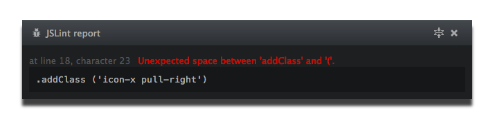

# Atom message panel

> An easy way to display your messages in [Atom](http://atom.io).



## Usage example

```javascript
// require the module
var msgPanel = require('atom-message-panel');

// init my panel with a nice title
msgPanel.init('My panel');
// add a message for the world to see
msgPanel.append.header('Nice big message, using Atom message panel', 'text-info');
```

## Why

To streamline how plugin messages are displayed in Atom.

## API

```javascript
// Initializes your panel with a 'title'
init(title)
// Doing some panel body clean up
clear()
// Removes your panel from this world
destroy()
// Only show the panel header, with the latest appended child (header, message or lineMessage)
fold(speed)
// Back to normal
unfold(speed)
// Adds a big nice header
append.header(text, className)
// Tell the people what your fell
append.message(msg, className)
// A line connected message, that will send the user to that line on click
append.lineMessage(line, character, msg, preview, className)
// Lets you add classes to specific line numbers
append.lineIndicators(lines, className)
```

## License

[MIT](http://opensource.org/licenses/MIT) © tcarlsen
